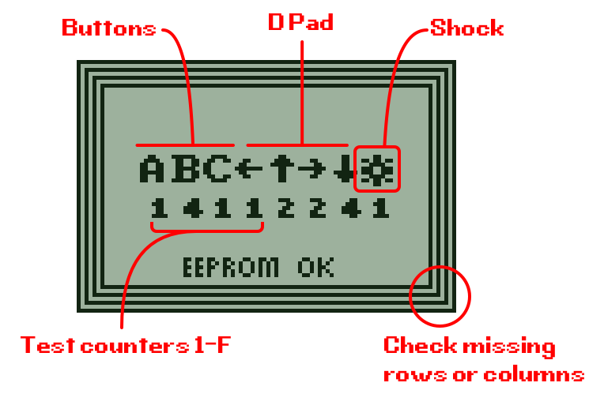

# Refurb tool for Pokémon Mini

I wrote this tool because I've started acquiring faulty Pokémon Mini consoles and having a way to quickly test all the inputs are working is useful.

## The UI

Pressing a button or triggering the shock will increment the counter. Initially the counter is empty (zero times), then cycles through from 1 to F (15) and then repeats.

## Compiling

Supported on Window and MacOS:

- Windows: run `make.bat`
- MacOS: run `make`

## Dependencies

These are included in the `bin` directory, but can be found here:

- [pmas 1.1](https://github.com/logicplace/PMAS/)
- [bmp2bin](https://www.pokemon-mini.net/tools/bmp2bin/)

## TODO

- Rumble on trigger button (currently I can't work out how to stop the rumble!)
- Sound
- Possibly infrared, but apparently it's not documented
